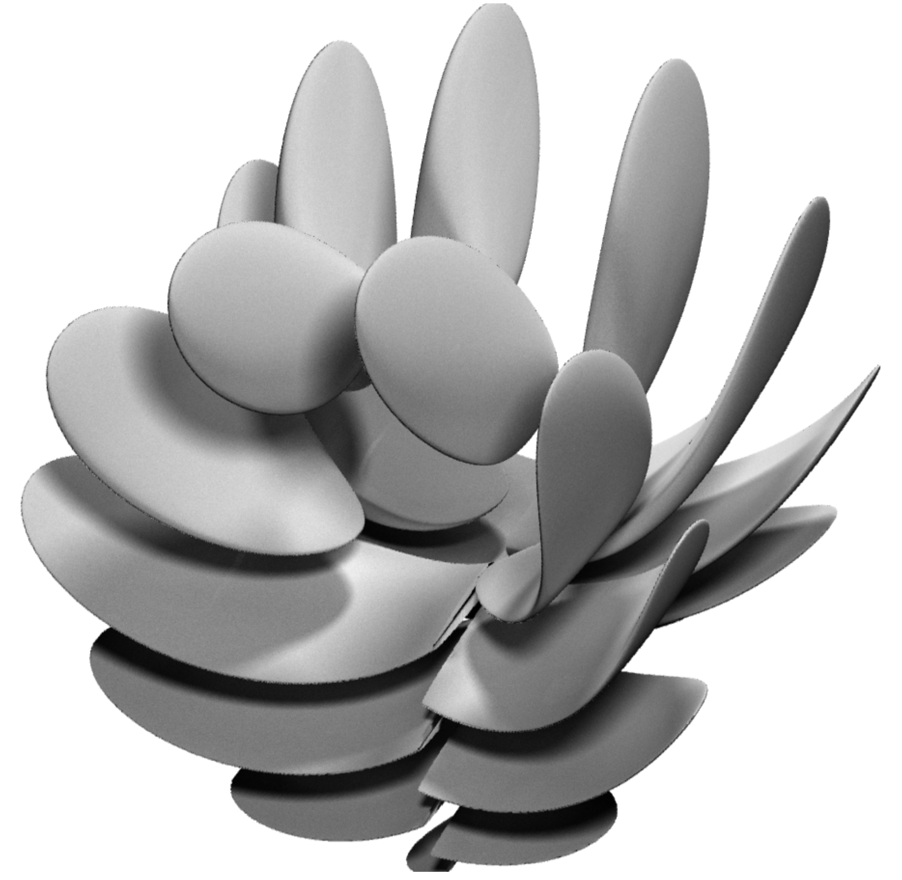

kovals-3d-grapher-5
===

Koval's 3D Grapher is a voxel-based, implicit surface and volume plotter in 3D targeted at webgl2.
 
Triangles embedded in 3D are not well suited for representing sets with "dimension" not equal to two. Furthermore, automatic and efficient triangulation is a significant challenge for a 3D plotter, especially in guaranteed-fail conditions like z = sin(1/x). For this version, we render our plot as binary (i.e. on/off) voxels in a 1024 x 1024 x 1024 grid.

The goal is to produce publication-quality renders of surfaces and volumes in the browser.

Koval's 3D grapher 5 is currently live here: <https://alankoval.com/3dgrapher/src/index.html>. 